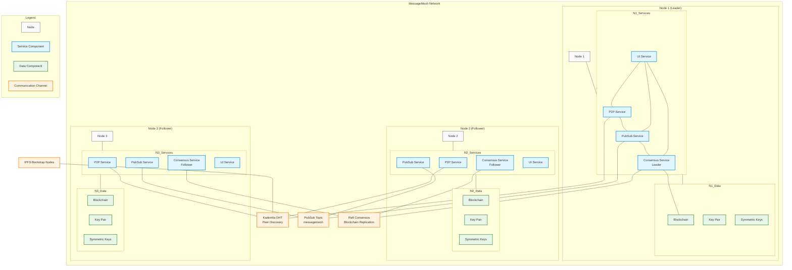

```mermaid
flowchart TD
    %% Define node styles
    classDef nodeStyle fill:#f9f9f9,stroke:#333,stroke-width:1px
    classDef serviceStyle fill:#e1f5fe,stroke:#0288d1,stroke-width:2px
    classDef dataStyle fill:#e8f5e9,stroke:#388e3c,stroke-width:2px
    classDef communicationStyle fill:#fff3e0,stroke:#f57c00,stroke-width:2px

    %% Network Nodes
    subgraph "MessageMesh Network"
        %% Node 1 - Full structure
        subgraph "Node 1 (Leader)"
            N1["Node 1"]
            
            subgraph "N1_Services"
                N1_P2P["P2P Service"]
                N1_PubSub["PubSub Service"]
                N1_Consensus["Consensus Service<br>Leader"]
                N1_UI["UI Service"]
            end
            
            subgraph "N1_Data"
                N1_Blockchain["Blockchain"]
                N1_KeyPair["Key Pair"]
                N1_SymKeys["Symmetric Keys"]
            end
            
            %% Connect services within Node 1
            N1 --- N1_Services
            N1_Services --- N1_Data
            N1_P2P --- N1_PubSub
            N1_PubSub --- N1_Consensus
            N1_Consensus --- N1_Blockchain
            N1_UI --- N1_P2P
            N1_UI --- N1_PubSub
            N1_UI --- N1_Consensus
        end
        
        %% Node 2 - Simplified
        subgraph "Node 2 (Follower)"
            N2["Node 2"]
            
            subgraph "N2_Services"
                N2_P2P["P2P Service"]
                N2_PubSub["PubSub Service"]
                N2_Consensus["Consensus Service<br>Follower"]
                N2_UI["UI Service"]
            end
            
            subgraph "N2_Data"
                N2_Blockchain["Blockchain"]
                N2_KeyPair["Key Pair"]
                N2_SymKeys["Symmetric Keys"]
            end
            
            %% Connect services within Node 2
            N2 --- N2_Services
            N2_Services --- N2_Data
        end
        
        %% Node 3 - Simplified
        subgraph "Node 3 (Follower)"
            N3["Node 3"]
            
            subgraph "N3_Services"
                N3_P2P["P2P Service"]
                N3_PubSub["PubSub Service"]
                N3_Consensus["Consensus Service<br>Follower"]
                N3_UI["UI Service"]
            end
            
            subgraph "N3_Data"
                N3_Blockchain["Blockchain"]
                N3_KeyPair["Key Pair"]
                N3_SymKeys["Symmetric Keys"]
            end
            
            %% Connect services within Node 3
            N3 --- N3_Services
            N3_Services --- N3_Data
        end
        
        %% Communication between nodes
        P2P_DHT["Kademlia DHT<br>Peer Discovery"]
        PubSub_Topic["PubSub Topic<br>messagemesh"]
        Raft_Consensus["Raft Consensus<br>Blockchain Replication"]
        
        %% Connect nodes through communication channels
        N1_P2P --- P2P_DHT
        N2_P2P --- P2P_DHT
        N3_P2P --- P2P_DHT
        
        N1_PubSub --- PubSub_Topic
        N2_PubSub --- PubSub_Topic
        N3_PubSub --- PubSub_Topic
        
        N1_Consensus --- Raft_Consensus
        N2_Consensus --- Raft_Consensus
        N3_Consensus --- Raft_Consensus
    end
    
    %% External Bootstrap Nodes
    Bootstrap["IPFS Bootstrap Nodes"]
    Bootstrap --- P2P_DHT
    
    %% Legend
    subgraph Legend
        L1["Node"]
        L2["Service Component"]
        L3["Data Component"]
        L4["Communication Channel"]
    end

    %% Apply styles
    class N1,N2,N3,L1 nodeStyle;
    class N1_P2P,N1_PubSub,N1_Consensus,N1_UI,N2_P2P,N2_PubSub,N2_Consensus,N2_UI,N3_P2P,N3_PubSub,N3_Consensus,N3_UI,L2 serviceStyle;
    class N1_Blockchain,N1_KeyPair,N1_SymKeys,N2_Blockchain,N2_KeyPair,N2_SymKeys,N3_Blockchain,N3_KeyPair,N3_SymKeys,L3 dataStyle;
    class P2P_DHT,PubSub_Topic,Raft_Consensus,Bootstrap,L4 communicationStyle;
``` 