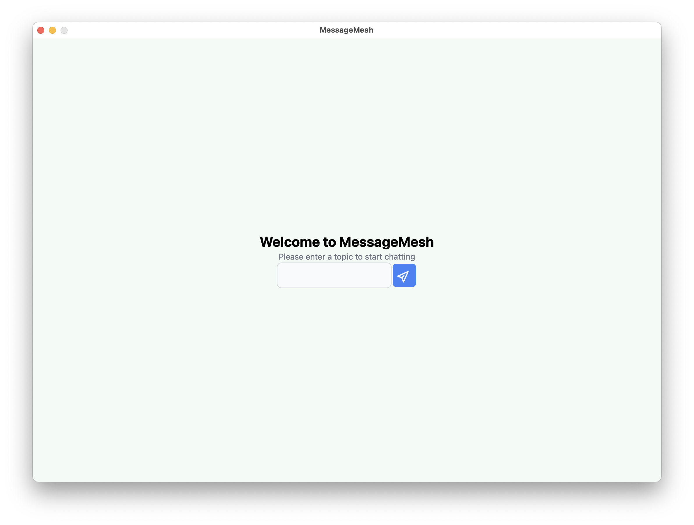
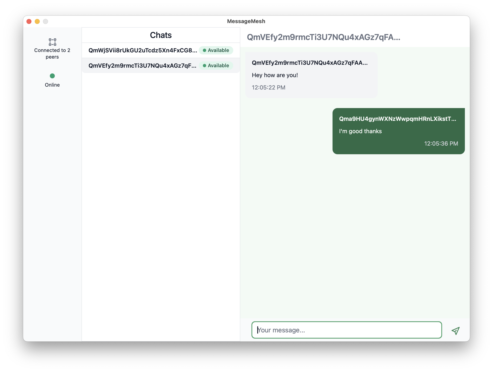

# ⚠️⚠️ WORK IN PROGRESS ⚠️⚠️

# MessageMesh

A decentralized, peer-to-peer messaging application built with Wails, Go, Svelte, and TypeScript. MessageMesh uses a Raft consensus algorithm to maintain a consistent state between all nodes in the network, ensuring secure and reliable communication.

## Features

- **Peer-to-Peer Messaging**: Send and receive messages directly between users with no central server
- **End-to-End Encryption**: Secure communication with encrypted messages
- **Decentralized Architecture**: Resilient network with no single point of failure
- **Consensus-Based**: Uses Raft algorithm to maintain consistent blockchain state across nodes
- **Cross-Platform**: Desktop application available for Windows, macOS, and Linux

## Technologies and Frameworks

### Core Technologies
- **[Go](https://golang.org/)**: Backend language
- **[Svelte](https://svelte.dev/)**: Frontend UI library
- **[TypeScript](https://www.typescriptlang.org/)**: Type-safe JavaScript
- **[Wails](https://wails.io/)**: Framework for building desktop applications with Go backend and web frontend

### Libraries and Tools
- **[Libp2p](https://libp2p.io/)**: Modular networking stack for peer-to-peer applications
- **[Hashicorp Raft](https://github.com/hashicorp/raft)**: Consensus algorithm implementation
- **[Bbolt](https://github.com/etcd-io/bbolt)**: Key/value store for Go
- **[Flowbite-Svelte](https://flowbite-svelte.com/)**: UI component library for Svelte
- **[Tailwind CSS](https://tailwindcss.com/)**: Utility-first CSS framework

## Project Structure

The project follows a standard Wails application structure, with separate backend (Go) and frontend (Svelte/TypeScript) components:

```
MessageMesh/
├── backend/                 # Go backend code
│   ├── models/              # Data models
│   ├── consensus.go         # Raft consensus implementation
│   ├── interface.go         # Backend interface definitions
│   ├── keys.go              # Cryptographic key management
│   ├── p2p.go               # Peer-to-peer networking
│   ├── pubSub.go            # Publish-subscribe functionality
│   └── server.go            # Backend server functionality
├── db/                      # Database-related files$$
├── frontend/                # Svelte/TypeScript frontend
│   ├── dist/                # Compiled frontend assets
│   ├── src/                 # Source code
│   └── wailsjs/            # Wails-generated JavaScript bindings
├── app.go                   # Main application code
├── main.go                  # Entry point
├── go.mod                   # Go module definition
├── go.sum                   # Go dependencies checksum
└── wails.json               # Wails configuration
```

## Setup and Installation

### Prerequisites

- [Go](https://golang.org/dl/) (version 1.18 or later)
- [Node.js](https://nodejs.org/) (version 16 or later)
- [Wails CLI](https://wails.io/docs/gettingstarted/installation)

### Installation

1. Clone the repository:
   ```bash
   git clone https://github.com/yourusername/MessageMesh.git
   cd MessageMesh
   ```

2. Install the Go dependencies:
   ```bash
   go mod download
   ```

## Running the Project

### Environment Configuration (.env)

Create a `.env` file in the root directory of the project with the following variables:

```
HEADLESS=false   # Set to true to run in non-GUI mode (for servers)
USERNAME=yourname  # Your username in the network
```

### Development Mode

Run the application in development mode:

```bash
wails dev
```

This will start both the Go backend and the Svelte frontend with hot-reloading.

### Building for Production

To build a production-ready application:

```bash
wails build
```

The compiled binaries will be available in the `build/bin` directory.


### Start Screen



When you start the application, a new user is created instantly and you are prompted to enter the pubsub topic you want to join.

### Chat Screen



When you join a topic, you can start sending messages to users in the topic.

## License

This project is licensed under the MIT License - see the LICENSE file for details.